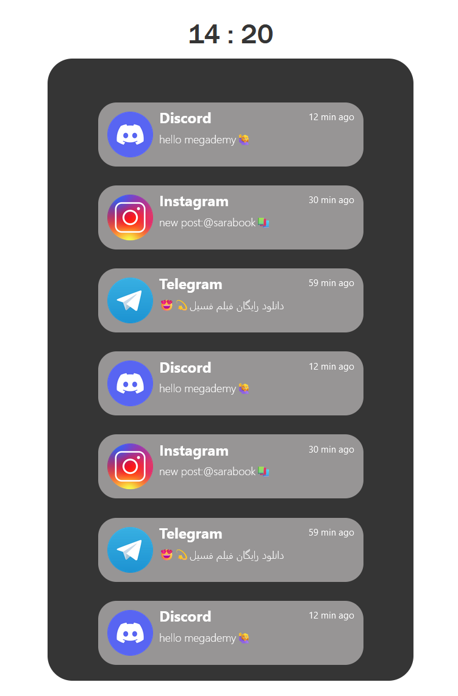

# MiniLibrary-Notif-React💬
---
## Getting started with a JavaScript library in the first course of React JS;

### This library is related to mobile phone lock screen notifications that are simply handled with JS codes.

#### `Display user interface : `

